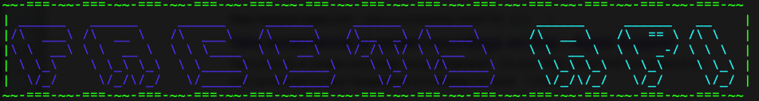
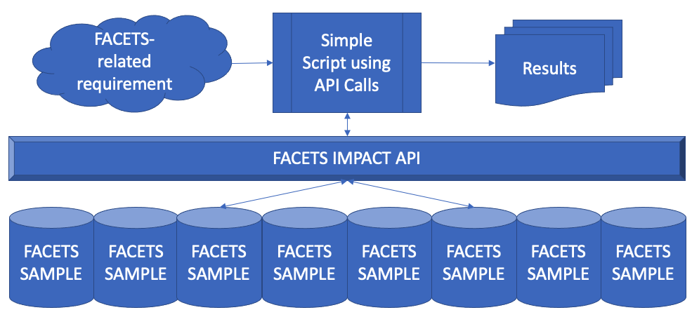
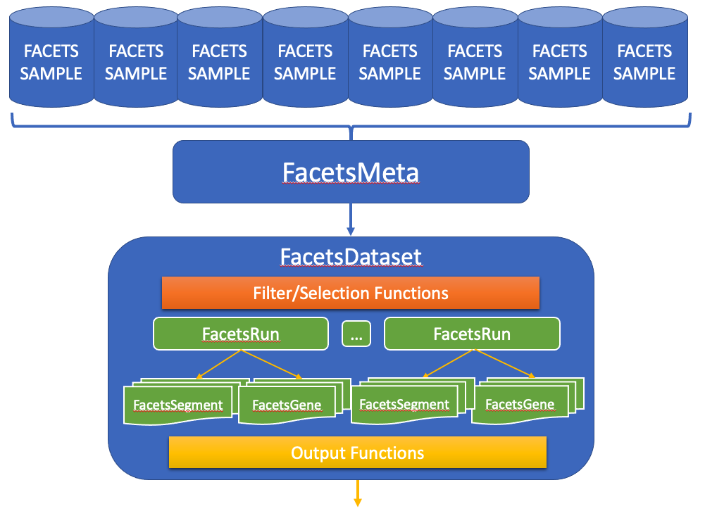

#  

## Background 

FacetsAPI is a python package for interacting with and manipulating Impact FACETS data at MSKCC.  

The Impact FACETS data repository represents a standardized file structure that we expect to be consistent across all samples. The primary Impact FACETS repository currently exists at `/work/ccs/shared/resources/impact/facets/all/`, however this API can be directed to work with any standardized FACETS file system.

In the file structure state, information about a sample is spread over many files. Meaning that if you want to work with FACETS data, you must know the details of the file structure and contents.  Additionally, the large number of sample stored in the FACETS data repository is cumbersome to work with when gathering samples with specific properties, leading to extensive manual cross-referencing and data manipulation that is time consuming and subject to human error.

 

FacetsAPI exists as an interactive layer between the user and the data, making working with FACETS data a more intuitive and quick process.

# Design

FacetsAPI provides a framework for interacting with this FACETS data, allowing users to specify specific conditions or to apply advanced operations directly to facets data without needing to have extensive experience in the distributed FACETS file structure, and without extensive manual interaction.  It incorporates a generalized design that allows it to address a variety of potential use-cases.

 

FACETS files contain a variety of files detailing segments, copy number alteration, QC, gene level data, and a variety of other useful information.  FacetsAPI structures this data into an object-oriented set of classes that work holistically to provide a structured way to work with the data.  
